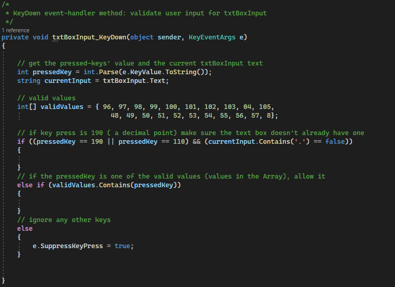

# Temperature Converter

a Windows Form App for converting among the 3 units of temperature; Fahrenheit, Celsius, and Kelvin.

## Build Process

1. Validate the user input through <u>KeyPress events</u>.

	- valid inputs are the following

		a. if the pressed key is a <u>decimal number</u> (0 through 9)

		b. if the pressed key is a <u>decimal point</u> (but we can only have up
		to 1 in the entire number)
		 

	

2. Processing the input

	- once the submit button is pressed, we retrieve the following 3 things;
	<u>the initial temperature</u>, <u>the initial temperature unit</u>, and <u>the final temperature 
	unit</u>.

	- this information is used to determine what the proper conversion formula is
	 

	

	- result is rounded to 2 decimal places before being displayed in the output 
	

## Resources

1. [.NET API browser (documentation)](https://learn.microsoft.com/en-us/dotnet/api/?view=net-7.0&term=system.string)

	- leveraged Windows documentation for referencing C# programming language syntax